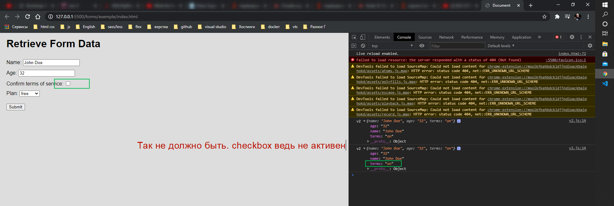
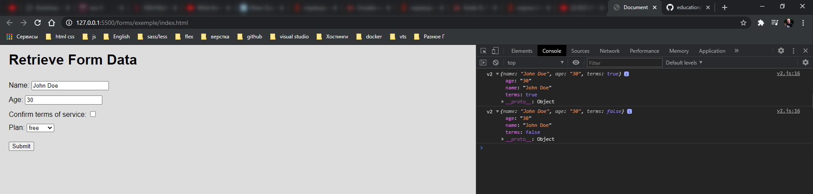
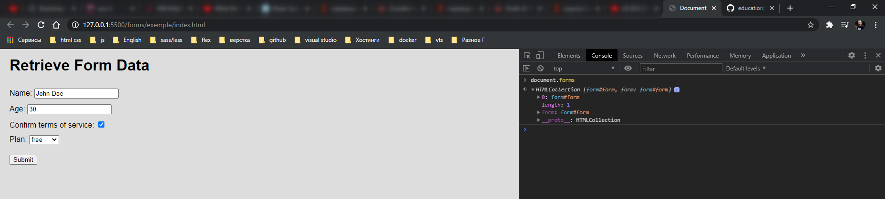
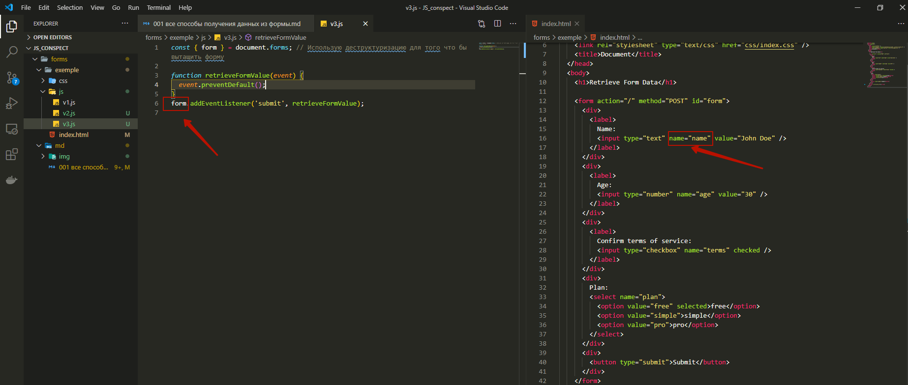
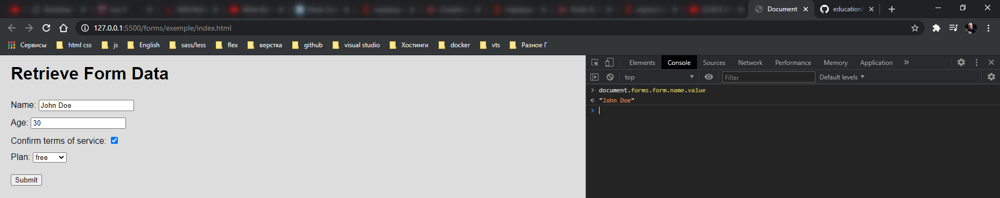
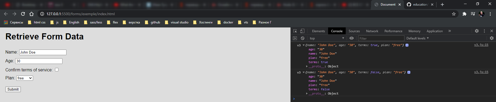
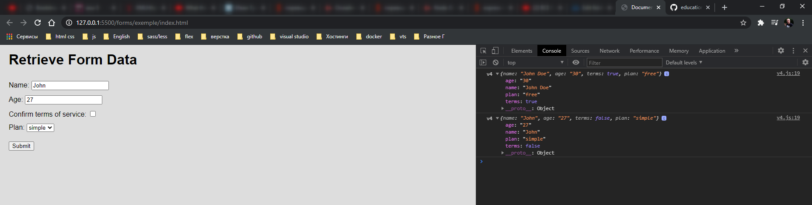
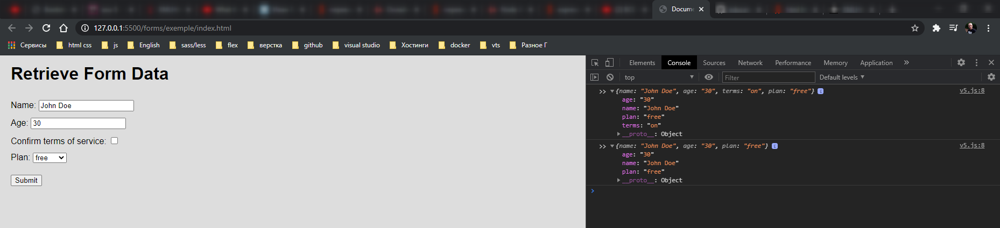
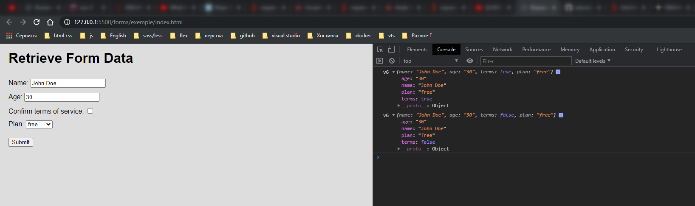

# Все способы получения данных из формы

<br>
<br>

[https://www.youtube.com/watch?v=zUjZmsnsjU0&t=743s](https://www.youtube.com/watch?v=zUjZmsnsjU0&t=743s)

<br>
<br>

<hr>

Все элементы управления в форме **input**, **textarea**, **button**, **select** должны находится внутри данного элемента **form**.

```html
<!DOCTYPE html>
<html lang="en">
  <head>
    <meta charset="UTF-8" />
    <meta name="viewport" content="width=device-width, initial-scale=1.0" />
    <link rel="stylesheet" type="text/css" href="css/index.css" />
    <title>Document</title>
  </head>
  <body>
    <h1>Retrieve Form Data</h1>

    <form action="/" method="POST" id="form">
      <div>
        <label>
          Name:
          <input type="text" name="name" value="John Doe" />
        </label>
      </div>
      <div>
        <label>
          Age:
          <input type="number" name="age" value="30" />
        </label>
      </div>
      <div>
        <label>
          Confirm terms of service:
          <input type="checkbox" name="terms" checked />
        </label>
      </div>
      <div>
        Plan:
        <select name="plan">
          <option value="free" selected>free</option>
          <option value="simple">simple</option>
          <option value="pro">pro</option>
        </select>
      </div>
      <div>
        <button type="submit">Submit</button>
      </div>
    </form>
  </body>
</html>
```

В **JavaScript** форма представлена объектом **HTMLFormElement** [https://developer.mozilla.org/ru/docs/Web/API/HTMLFormElement](https://developer.mozilla.org/ru/docs/Web/API/HTMLFormElement). После ее создания в **html** мы можем к ней обратиться для получения введенных пользователем данных. Существует множество способов получить данные из **html** формы.

<br>
<br>

**Метод №1**

Нужно найти по отдельности требуемы поля. Достать из них данные и отправить их на сервер. Или в моем случае вывести в консоль.

```js
const form = document.getElementById('form'); // Нахожу форму

function retrieveFormValue(event) {
  event.preventDefault(); // т.к. форму на сервер отправлять не нужно вызываю этот метод. Отправка происходит без перезагрузки

  //получаю поля формы и достаю из них значения
  const name = form.querySelector('[name="name"]');
  age = form.querySelector('[name="age"]');
  terms = form.querySelector('[name="terms"]');
  plan = form.querySelector('[name="plan"]');

  // Создаю объект в который помещаю полученные данные
  const values = {
    name: name.value,
    age: age.value,
    plan: plan.value,
    terms: terms.checked, // checkbox
  };
  console.log('v1', values);
}

form.addEventListener('submit', retrieveFormValue); // при отправке фрмы срабатывает событие submit, оно обычно используется для валидации формы перед отправкой на сервер или для предотвращения отправки и обработки ее с помощью JS
```

Данный способ простой но не самый эффективный.

<br>
<br>

Метод 2.

Нам все так же понадобится сама форма и обработчик события.

```js
const form = document.getElementById('form');

form.addEventListener('submit', retrieveFormValue);
```

А саму функцию я перепишу. В место перечисления полей я буду использовать цикл. При этом найдем все возможные элементы формы и динамически извлечем из них данные. Создадим переменную **fields** и найдем все потенциальные элементы которые являются полями формы.

```js
const form = document.getElementById('form');

function retrieveFormValue(event) {
  event.preventDefault();
}

const fields = document.querySelectorAll('input', 'select', 'textarea'); // выбираю все элементы формы

form.addEventListener('submit', retrieveFormValue);
```

Далее создаю переменную **values** в которую буду собирать все полученные из формы значения.

Перебираю коллекцию **fields** циклом **forEach**. Получаю каждое поле **field =>{}**. На каждой итерации достаю из поля **const{name, value} = field;** И сохраняю их в объект **values[name] = value;**

```js
const form = document.getElementById('form');

function retrieveFormValue(event) {
  event.preventDefault();

  const fields = document.querySelectorAll('input', 'select', 'textarea'); // выбираю все элементы формы
  const values = {};

  fields.forEach((field) => {
    const { name, value } = field;

    values[name] = value;
  });
  console.log('v2', values);
}

form.addEventListener('submit', retrieveFormValue);
```

```html
<!DOCTYPE html>
<html lang="en">
  <head>
    <meta charset="UTF-8" />
    <meta name="viewport" content="width=device-width, initial-scale=1.0" />
    <link rel="stylesheet" type="text/css" href="css/index.css" />
    <title>Document</title>
  </head>
  <body>
    <h1>Retrieve Form Data</h1>

    <form action="/" method="POST" id="form">
      <div>
        <label>
          Name:
          <input type="text" name="name" value="John Doe" />
        </label>
      </div>
      <div>
        <label>
          Age:
          <input type="number" name="age" value="30" />
        </label>
      </div>
      <div>
        <label>
          Confirm terms of service:
          <input type="checkbox" name="terms" checked />
        </label>
      </div>
      <div>
        Plan:
        <select name="plan">
          <option value="free" selected>free</option>
          <option value="simple">simple</option>
          <option value="pro">pro</option>
        </select>
      </div>
      <div>
        <button type="submit">Submit</button>
      </div>
    </form>
    <script src="js/v2.js"></script>
  </body>
</html>
```



Вместо true или **false** в **checkbox** я вижу **on**.

Дело в том что мы извлекаем только значение **value**, а в случае с **checkbox** и **radiobutton** нам нужно извлекать поле **cheked**. Поэтому нам нужно написать вспомогательную функцию является ли поле **checkbox** или **radiobutton**.

Назову данную функию **isCheckboxOrRadio =** мы будем проверять **type =>** при проверке должно возвращаться **true**. т.е. **const isCheckboxOrRadio = (type) => ['checkbox', 'radio'].includes(type); // при проверке 'checkbox', 'radio' возвращает true, во всех остальных случаях false.**

Далее при переборе коллекции **fields**. Перед тем как записать **value** мы будем проверять что если значение данного поля checked мы будем брать его иначе будет **value**. Проверку произвожу с помощью тернарных операторов.

```js
const isCheckboxOrRadio = (type) => ['checkbox', 'radio'].includes(type); // при проверке 'checkbox', 'radio' возвращает true, во всех остальных случаях false

const form = document.getElementById('form');

function retrieveFormValue(event) {
  event.preventDefault();

  const fields = document.querySelectorAll('input', 'select', 'textarea'); // выбираю все элементы формы
  const values = {};

  fields.forEach((field) => {
    const { name, value, type, checked } = field;

    values[name] = isCheckboxOrRadio(type) ? checked : value;
  });
  console.log('v2', values);
}

form.addEventListener('submit', retrieveFormValue);
```



Но мы все еще ищим все элементы т.е. при отправке формы каждый раз происходит поиск элементов.

Мы можем сделать лучше т.к. браузер нам предоставляет очень большой **API** по работе с формами.

<br>
<br>

**Метод №3**.

Нам не обязательно искать саму форму и ее поля. Дело в том что все формы храняться в объекте **document.forms**. Таким образов в **devTools** я могу получить коллекцию всех форм доступных на странице.



При этом извлечь нужную форму можно несколькими способами. Это по **index** т.е. по **index** в массиве. У нас первая форма имеет **index[0]**.

Т иак же можно получить по **id** формы. Или же по **name**.

Воспользуюсь **id** формы. **const { form } = document.forms; // Использую деструктуризацию для того что бы вытащить форму**.

И нам все так же понадобится **eventListenner** и функция обработчик данного события.

```js
const { form } = document.forms; // Использую деструктуризацию для того что бы вытащить форму

function retrieveFormValue(event) {
  event.preventDefault();
}
form.addEventListener('submit', retrieveFormValue);
```

Аналогично **document.forms** в самом экземпляре формы ее поля ввода храняться как ключи. Имя name в форме соответствует полю форм в **js**.



Мы можем проверить это в **devTools**.



Получается так что нам вообще не нужно искать поля формы. Мы их можем получить сразу из самой формы по **name=""**.

```js
const { form } = document.forms; // Использую деструктуризацию для того что бы вытащить форму

function retrieveFormValue(event) {
  event.preventDefault();

  const { name, age, terms, plan } = form; // обращаюсь к полям
}
form.addEventListener('submit', retrieveFormValue);
```

И далее извлекаю из них значения.

```js
const { form } = document.forms; // Использую деструктуризацию для того что бы вытащить форму

function retrieveFormValue(event) {
  event.preventDefault();

  const { name, age, terms, plan } = form; // обращаюсь к полям

  const values = {
    name: name.value,
    age: age.value,
    terms: terms.checked,
    plan: plan.value,
  };

  console.log('v3', values);
}
form.addEventListener('submit', retrieveFormValue);
```

```html
<!DOCTYPE html>
<html lang="en">
  <head>
    <meta charset="UTF-8" />
    <meta name="viewport" content="width=device-width, initial-scale=1.0" />
    <link rel="stylesheet" type="text/css" href="css/index.css" />
    <title>Document</title>
  </head>
  <body>
    <h1>Retrieve Form Data</h1>

    <form action="/" method="POST" id="form">
      <div>
        <label>
          Name:
          <input type="text" name="name" value="John Doe" />
        </label>
      </div>
      <div>
        <label>
          Age:
          <input type="number" name="age" value="30" />
        </label>
      </div>
      <div>
        <label>
          Confirm terms of service:
          <input type="checkbox" name="terms" checked />
        </label>
      </div>
      <div>
        Plan:
        <select name="plan">
          <option value="free" selected>free</option>
          <option value="simple">simple</option>
          <option value="pro">pro</option>
        </select>
      </div>
      <div>
        <button type="submit">Submit</button>
      </div>
    </form>
    <script src="js/v3.js"></script>
  </body>
</html>
```



Но если полей в форме будет становиться все больше, нам каждый раз придется обращаться к новому полю и увеличивать объект получения значения. По этому данный способ можно автоматизировать.

<br>
<br>

Метод №4

Нам все так же нужна форма и обработчик события.

```js
const { form } = document.forms;

function retrieveFormValue(event) {
  event.preventDefault();
}

form.addEventListener('submit', retrieveFormValue);
```

В форме есть коллекция элементов она содержится в **elements**. Работает оно по такому же принципу как и **document.forms**.

Получаем коллекцию элементов из формы **const { elements } = form; // получаем элементы из формы**.

Далее создаю объект **values** в который буду аккумулировать все значения полей.

```js
const { form } = document.forms;

function retrieveFormValue(event) {
  event.preventDefault();

  const { elements } = form; // получаем элементы из формы
  const values = {}; // аккумулирую все значения полей
}

form.addEventListener('submit', retrieveFormValue);
```

После чего перебираю **elements** с помощью цикла.

```js
const { form } = document.forms;

function retrieveFormValue(event) {
  event.preventDefault();

  const { elements } = form; // получаем элементы из формы
  const values = {}; // аккумулирую все значения полей

  for (let i = 0; i < elements.length; i++) {
    const formElement = elements[i];
    const { name } = formElement; // проверяю наличие атрибута name для того что бы отбросить кнопки
    if (name) {
      const { value, type, checked } = formElement; // если поле name есть то достаю значения
    }
  }
}

form.addEventListener('submit', retrieveFormValue);
```

т.к. мне нужно доставать либо **values** либо **checked** то я воспользуюсь проверкой из предыдущих примеров.

```js
const isCheckboxOrRadio = (type) => ['checkbox', 'radio'].includes(type); // при проверке 'checkbox', 'radio' возвращает true, во всех остальных случаях false

const { form } = document.forms;

function retrieveFormValue(event) {
  event.preventDefault();

  const { elements } = form; // получаем элементы из формы
  const values = {}; // аккумулирую все значения полей

  for (let i = 0; i < elements.length; i++) {
    const formElement = elements[i];
    const { name } = formElement; // проверяю наличие атрибута name для того что бы отбросить кнопки
    if (name) {
      const { value, type, checked } = formElement; // если поле name есть то достаю значения
      values[name] = isCheckboxOrRadio(type) ? checked : value;
    }
  }
  console.log('v4', values);
}

form.addEventListener('submit', retrieveFormValue);
```



Мы больше не используем селекторы для поска элементов, во - вторых нам не нужно перечислять все элементы которые мы хотим получать. Мы обрабатываем форму целиком.

<br>
<br>
<br>

**Метод №5**

Это извлечение данных из формы с помощью конструктора **formData**.

```js
const { form } = document.forms;

function retrieveFormValue(event) {
  event.preventDefault();

  const formData = new formData();
}

form.addEventListener('submit', retrieveFormValue);
```

Обычно этот конструктор используется для передачи данных по **XMLHttpRequest** [https://developer.mozilla.org/ru/docs/Web/API/XMLHttpRequest](https://developer.mozilla.org/ru/docs/Web/API/XMLHttpRequest). Но так же с помощью него можно извлечь данные из формы если передать в **instance** нового объекта сам объект **form**.

Далее я могу получить значиния из полей с помощью **const values = Object.fromEntries(formData.entries());**

```js
const { form } = document.forms;

function retrieveFormValue(event) {
  event.preventDefault();

  const formData = new FormData(form);
  const values = Object.fromEntries(formData.entries());
  console.log('>>', values);
}

form.addEventListener('submit', retrieveFormValue);
```

Теперь если мы посмотрим на **checkbox** то увидим on. Значит проблема вернулась? На самом деле нет. Если **checkbox** не выбран он вообще не попадет в данный объект.



т.е. метод fornData возмет только валидные значения нашей формы и добавит их в объект **values**.

<br>
<br>

Метод №6

Извлечение данных с помощью цикла **for of**. Данный цикл предназначен не только для перебора массива или объекта, но и других коллекций, строки, генераторы, коллекции **DOM** элементов.

```js
const { form } = document.forms;

function retrieverFormValue(event) {
  event.preventDefault();

  for (let field of form) {
  }
}

form.addEventListener('submit', retrieverFormValue);
```

Создаю объект **values** в который аккумулирую все значения **const values = {};**

В цикле получаю name из поля формы

```js
const isCheckboxOrRadio = (type) => ['checkbox', 'radio'].includes(type); // при проверке 'checkbox', 'radio' возвращает true, во всех остальных случаях false

const { form } = document.forms;

function retrieverFormValue(event) {
  event.preventDefault();

  const values = {};

  for (let field of form) {
    const { name } = field;

    if (name) {
      const { type, checked, value } = field;
      values[name] = isCheckboxOrRadio(type) ? checked : value; // Записываю значения по ключу name
    }
  }
  console.log('v6', values);
}

form.addEventListener('submit', retrieverFormValue);
```


